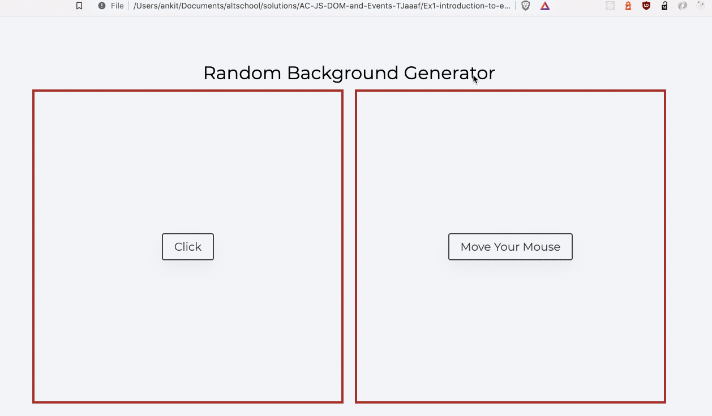

#### Random Color Generator

1. Create two boxes with buttons in center
2. First button with `click` and second with `move your mouse` label
3. When clicked in the first box the background of the box should change to any random color
4. When moving the mouse in box 2 will change the background of the the box to random color

#### Final Output

