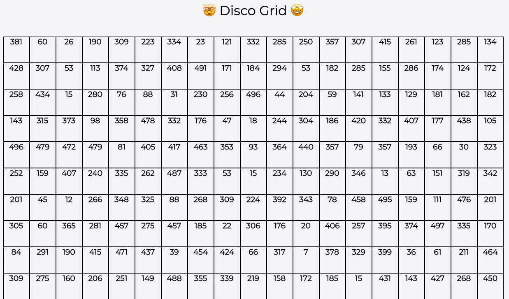

#### Disco Grid

1. Create 500 boxes of size (4rem and 4rem)
2. Each box will contain a random number from 0 - 500
3. When moving the mouse over the boxes the background color of each box should change to some random color.
4. Along with random color the random number should also change.

#### Final Output

