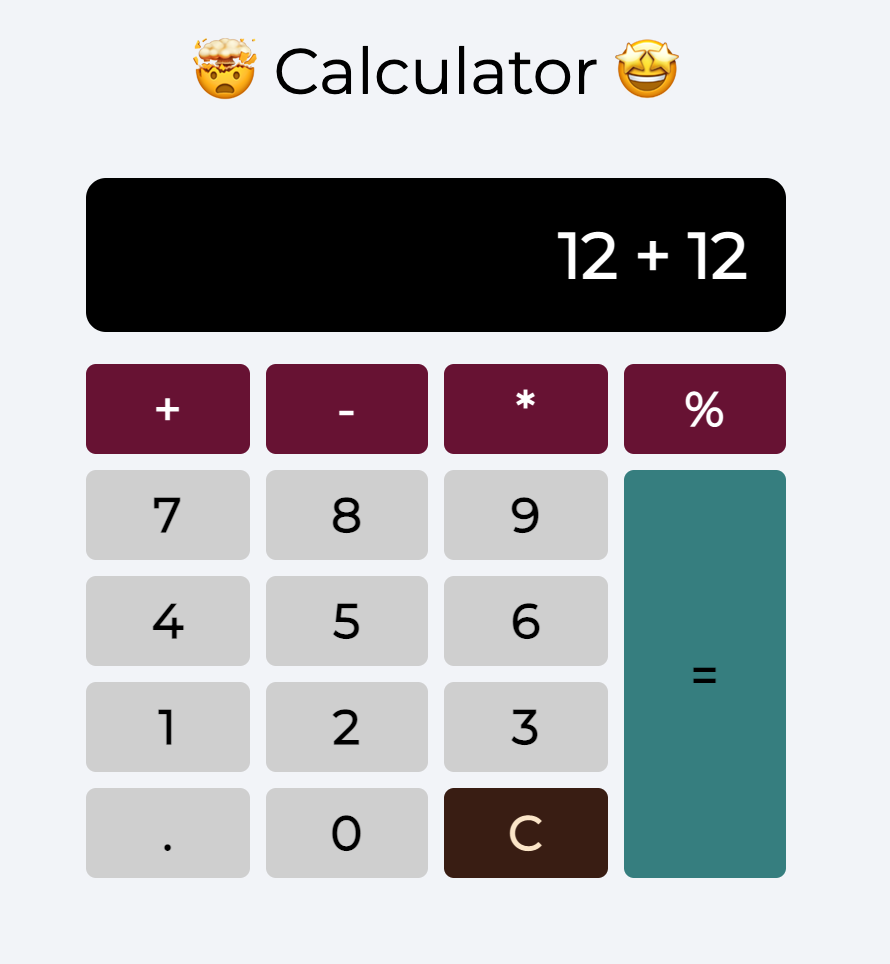

#### Making a Calculator

1. Create a calculator with operations like:

- Addition
- Subtraction
- Multiplication
- Division

2. It should contain a button `CLEAR` when pressed should clear the screen
3. It will also contain a `=` button when pressed will show the result

** You can use [eval](https://javascript.info/eval) to execute the code **

#### Final Output

