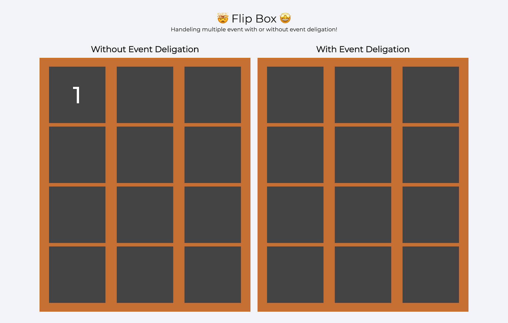

#### Flip Box

1. There are two boxes each box contains 12 small boxes
2. When you click on the small boxes it will show the number from 1 to 12 and disappear in next 5 seconds
3. In first box do it using multiple event listeners
4. In second box do it using event delegation

#### Final Output

