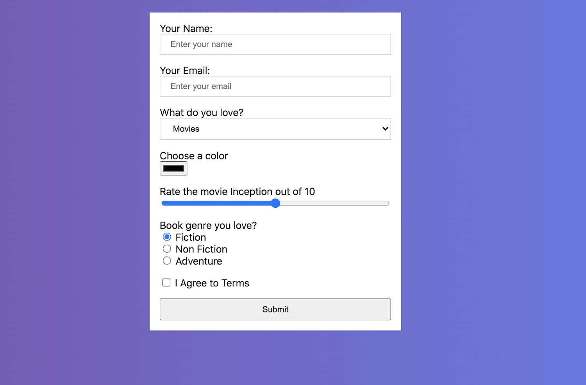
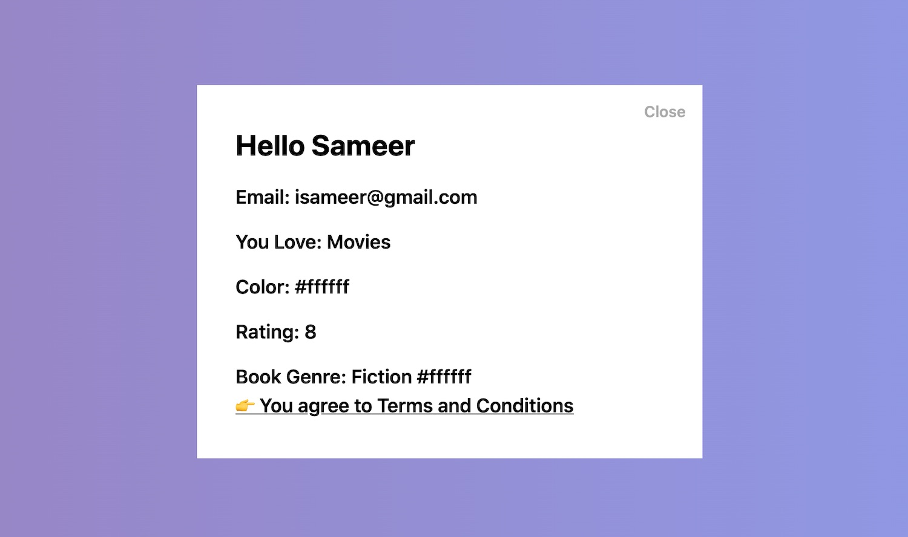

#### Handling Different Input Elements

1. Access the information from all these input elements in `index.html` inside `code` folder
2. After filling up the form when you click on the submit button a modal should be visible
3. The modal should also have a close button when clicked the model should close
4. To access the data use `form` element
5. Write your JavaScript code in `script.js` file

Form View:

Modal will look something like this:

